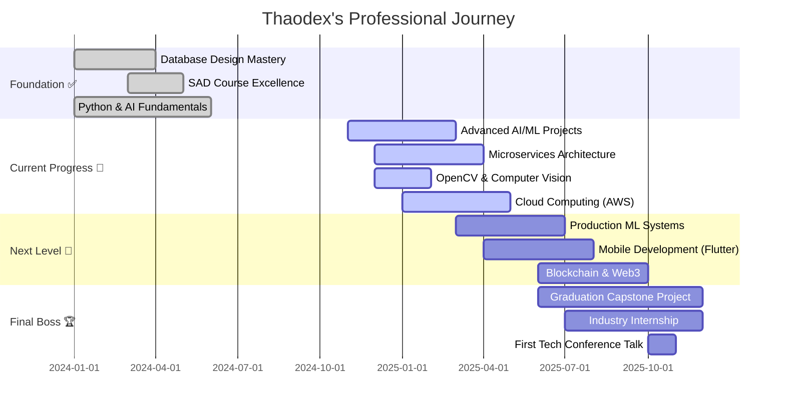

<div align="center">

<!-- Enhanced Miku-themed gradient banner with animation -->


<br/>

<!-- Animated profile section -->
<table>
<tr>
<td align="center" width="50%">

</td>
<td align="center" width="50%">

### 💫 Quick Stats


</td>
</tr>
</table>

<h1 align="center">
  <span style="color:#39C5BB;">こんにちは! I'm</span> 
  <a href="https://github.com/thaodex" style="color:#E05090; text-decoration: none;">Thaodex (DcThao)</a> 
  
</h1>

<a href="https://git.io/typing-svg">
  
</a>

<!-- Enhanced social badges -->
<p>
  <a href="mailto:dtc245200482@ictu.edu.vn">
    
  </a>
  <a href="https://github.com/thao206">
    
  </a>
  <a href="#">
    
  </a>
  <a href="#">
    
  </a>
  <a href="#">
    
  </a>
</p>

</div>

<br/>


## 🎵 **About Me: The Virtual Coder**


```python
class Thaodex:
    def __init__(self):
        self.name = "DcThao"
        self.role = "System Analyst & AI Engineer"
        self.university = "ICTU - Information and Communication Technology University"
        self.location = "Thái Nguyên, Vietnam 🇻🇳"
        self.coding_soundtrack = "Hatsune Miku - Project DIVA ♫"
        self.productivity_boost = "+39% with Miku vibes 🎵"
        self.current_level = 42  # Always leveling up!
        
    def current_focus(self):
        return {
            "AI/ML": ["Deep Learning", "NLP", "Computer Vision"],
            "Backend": ["FastAPI", "Microservices", "REST APIs"],
            "Database": ["PostgreSQL", "MongoDB", "Redis"],
            "DevOps": ["Docker", "Kubernetes", "CI/CD"],
            "System Design": ["Architecture Patterns", "Scalability"]
        }
    
    def future_goals(self):
        return [
            "🎯 Master Cloud Architecture (AWS/Azure)",
            "🚀 Contribute to major open-source projects",
            "📚 Publish technical articles & tutorials",
            "🌟 Build products that impact millions"
        ]
    
    def life_philosophy(self):
        return """
        Code is not just logic, it's art! 💙
        Every bug is a learning opportunity ✨
        Collaboration > Competition 🤝
        """

# Initialize the journey
developer = Thaodex()
developer.keep_coding_with_miku_vibes()  # 🎵
```

<br clear="right"/>

### 🌟 **Who Am I?**

🎓 **Sinh viên năng nổ** tại **ICTU** - nơi tôi kết hợp đam mê công nghệ với khả năng sáng tạo không giới hạn

💻 **Chuyên môn cốt lõi:**
- 🤖 **AI/ML Engineering** - Xây dựng các hệ thống thông minh với Deep Learning & NLP
- 📊 **System Analysis & Design** - Thiết kế kiến trúc hệ thống quy mô lớn
- 🗄️ **Database Architecture** - Tối ưu hóa & scaling databases phức tạp
- 🌐 **Full-Stack Development** - From frontend magic to backend power

🎯 **Mission Statement:** Không chỉ viết code, mà tạo ra các giải pháp có ý nghĩa, có tác động thực sự đến cộng đồng

💙 **Secret Sauce:** Năng suất coding tăng 39% khi nghe Project DIVA playlist - đã được kiểm chứng! 🎵


## 🎯 **Current Quests & Mission Control**

<div align="center">

### 🚀 **Active Missions**

<table>
<tr>
<td align="center" width="33%">

#### 🔄 **Currently Learning**
```yaml
- Advanced RAG Systems
- LangChain & Vector DBs
- Kubernetes Orchestration
- GraphQL & Apollo
- System Design at Scale
```

</td>
<td align="center" width="33%">

#### 🛠️ **Building Now**
```yaml
- AI Mentor Chatbot v3.0
- Smart Attendance System
- Real-time Analytics Dashboard
- Personal Portfolio v2
- Open Source CLI Tools
```

</td>
<td align="center" width="33%">

#### 📚 **Deep Diving Into**
```yaml
- Clean Architecture (Uncle Bob)
- Domain-Driven Design
- Microservices Patterns
- ML System Design
- Cloud Native Apps
```

</td>
</tr>
</table>

</div>

### 🗺️ **Development Roadmap 2024-2026**



### 📊 **Progress Metrics Dashboard**

<div align="center">

| Skill Domain | Current Level | Target | Progress |
|:-------------|:-------------:|:------:|:--------:|
| AI/ML Engineering | ⭐⭐⭐⭐☆ | Expert | `████████░░` 80% |
| System Design | ⭐⭐⭐⭐☆ | Expert | `███████░░░` 75% |
| Database Architecture | ⭐⭐⭐⭐☆ | Expert | `███████░░░` 75% |
| Backend Development | ⭐⭐⭐⭐☆ | Expert | `███████░░░` 70% |
| Frontend & UX | ⭐⭐⭐☆☆ | Advanced | `██████░░░░` 60% |
| DevOps & Cloud | ⭐⭐⭐☆☆ | Advanced | `█████░░░░░` 55% |

</div>


## 🛠️ **Arsenal: My Tech Stack**

<div align="center">

### **💻 Programming Languages**
<p>
  
</p>

### **🚀 Frameworks & Libraries**

#### Backend & APIs
<p>
  
  
  
</p>

#### Frontend
<p>
  
  
</p>

#### AI/ML & Data Science
<p>
  
  
  
  
  
  
</p>

### **🗄️ Databases & Storage**
<p>
  
  
</p>

### **☁️ Cloud & DevOps**
<p>
  
  
</p>

### **🔧 Tools & Platforms**
<p>
  
  
  
</p>

</div>

### 📊 **Skill Proficiency Matrix**

```text
Python & AI/ML      ████████████████████░  85% ⚡ Primary Stack
System Analysis     ████████████████░░░░░  80% 🎯 Core Strength  
Database & SQL      ███████████████░░░░░░  75% 🗄️ Advanced
Backend APIs        ███████████████░░░░░░  75% 🚀 Production Ready
React & Frontend    █████████████░░░░░░░░  65% ⚛️ Growing
DevOps & Cloud      ████████████░░░░░░░░░  60% ☁️ Learning
Mobile Dev          █████████░░░░░░░░░░░░  45% 📱 Exploring
```


## 🏆 **Achievements Unlocked**

<div align="center">


<br/><br/>

### 🎖️ **Achievement Timeline**

| 🏅 Achievement | 📅 Date | 💎 Rarity | 🎯 Impact |
|:---------------|:-------:|:---------:|:---------:|
| 🎓 **Database Architecture Master** | Dec 2024 | ⭐⭐⭐⭐⭐ | High |
| 🤖 **AI Model Deployment Pro** | Jan 2025 | ⭐⭐⭐⭐⭐ | High |
| 👥 **Team Lead Excellence** | Nov 2024 | ⭐⭐⭐⭐ | Medium |
| 🔥 **100 Day Coding Streak** | Jan 2025 | ⭐⭐⭐⭐⭐ | Epic |
| ⭐ **Open Source Contributor** | Ongoing | ⭐⭐⭐ | Growing |
| 🚀 **Production Deploy Master** | Dec 2024 | ⭐⭐⭐⭐ | High |
| 📚 **Technical Writer** | Jan 2025 | ⭐⭐⭐ | Medium |
| 🎯 **Problem Solving Expert** | Continuous | ⭐⭐⭐⭐⭐ | Critical |

### 🎮 **Level Progress**

```
╔═══════════════════════════════════════════════════════════╗
║                     CHARACTER STATUS                      ║
╠═══════════════════════════════════════════════════════════╣
║  Level: 42            XP: 15,847 / 20,000                 ║
║  ████████████████░░░░ 79% to Level 43                     ║
║                                                           ║
║  💪 Strength (Coding):     ████████████████████░  95      ║
║  🧠 Intelligence (Logic):  ███████████████████░░  92      ║
║  ⚡ Agility (Learning):    ████████████████░░░░  85      ║
║  🎯 Focus (Debugging):     ████████████████████░  96      ║
║  🤝 Charisma (Teamwork):   ███████████████░░░░░  78      ║
╚═══════════════════════════════════════════════════════════╝
```

</div>


## 💫 **Featured Projects: Hall of Fame**

<div align="center">

<!-- Project Cards Grid -->
<table>
<tr>
<td width="50%">

### 🧠 **AI Mentor Assistant**
[](https://github.com/thao206/ai-mentor)

**Tech Stack:**  


**Features:**
- 🤖 Advanced NLP with GPT-4
- 📊 Learning analytics dashboard
- 🎯 Personalized study paths
- 📚 Context-aware Q&A

**Status:** 🔄 `v3.0 Development`

</td>
<td width="50%">

### 📸 **Smart Face Attendance**
[](https://github.com/thao206/face-attendance)

**Tech Stack:**  


**Features:**
- 👤 Real-time face recognition
- ⚡ Sub-second processing
- 📊 Attendance analytics
- 🔒 Privacy-first design

**Status:** 🔨 `MVP Testing`

</td>
</tr>

<tr>
<td width="50%">

### 📚 **Library Management System**
[](https://github.com/thao206/library-system)

**Tech Stack:**  


**Features:**
- 📖 Complete book lifecycle
- 👥 Multi-role authentication
- 📊 Analytics & reporting
- 🔍 Advanced search filters

**Status:** ✅ `Production Ready`

</td>
<td width="50%">

### 🌐 **Portfolio Website v2**
[](https://github.com/thao206/portfolio)

**Tech Stack:**  


**Features:**
- ✨ Miku-themed animations
- 🎨 Interactive project showcase
- 📱 Fully responsive
- 🌙 Dark mode support

**Status:** 🎨 `Design Phase`

</td>
</tr>
</table>

<br/>

### 🚀 **More Projects Coming Soon...**

<p>


</p>

</div>


## 📊 **GitHub Analytics: Data Dashboard**

<div align="center">

<!-- Stats Cards -->


<br/><br/>

<!-- Streak Stats -->


<br/><br/>

<!-- Activity Graph -->


<br/><br/>

### 📈 **Weekly Development Breakdown**

<!--START_SECTION:waka-->
```text
💻 This Week's Coding Stats:

Python       14 hrs 25 mins  ████████████░░░░░░░░  50.2%  🐍 AI/ML Projects
JavaScript   7 hrs 15 mins   ██████░░░░░░░░░░░░░░  25.3%  ⚛️ React Development  
SQL          3 hrs 45 mins   ███░░░░░░░░░░░░░░░░░  13.1%  🗄️ Database Design
TypeScript   2 hrs 10 mins   ██░░░░░░░░░░░░░░░░░░   7.6%  📘 Type Safety
Other        1 hr 5 mins     █░░░░░░░░░░░░░░░░░░░   3.8%  📝 Documentation

🔥 Most Used IDE: VS Code (98.7%)
⏰ Best Coding Time: 22:00 - 02:00 (Night Owl 🦉)
☕ Coffee Consumed: 23 cups this week
```
<!--END_SECTION:waka-->

### 🎯 **Contribution Heatmap**


</div>


## 💡 **Wisdom & Philosophy**

<div align="center">

```
╔══════════════════════════════════════════════════════════════════╗
║                                                                  ║
║  "Code is like music - it needs rhythm, harmony, and passion    ║
║   to create something truly beautiful and meaningful!"          ║
║                                                                  ║
║  "The best code is not the cleverest - it's the most readable   ║
║   and maintainable by your future self at 3 AM."               ║
║                                                                  ║
║                                          - Hatsune Miku 🎵       ║
║                                          - Thaodex Philosophy   ║
║                                                                  ║
╚══════════════════════════════════════════════════════════════════╝
```

<br/>


<br/><br/>

### 🎯 **Development Principles**

<table>
<tr>
<td align="center" width="20%">

**💡 Clean Code**
<br/>
<sub>Readable &<br/>Maintainable</sub>

</td>
<td align="center" width="20%">

**🧪 Test First**
<br/>
<sub>TDD for<br/>Quality</sub>

</td>
<td align="center" width="20%">

**🔍 Code Review**
<br/>
<sub>Learn from<br/>Everyone</sub>

</td>
<td align="center" width="20%">

**🚀 CI/CD**
<br/>
<sub>Deploy with<br/>Confidence</sub>

</td>
<td align="center" width="20%">

**🎵 Have Fun**
<br/>
<sub>Enjoy the<br/>Journey!</sub>

</td>
</tr>
</table>

<br/>

### 📚 **Favorite Tech Quotes**

> *"Any fool can write code that a computer can understand. Good programmers write code that humans can understand."*  
> — Martin Fowler

> *"First, solve the problem. Then, write the code."*  
> — John Johnson

> *"Make it work, make it right, make it fast."*  
> — Kent Beck

</div>


## 🎪 **Fun Zone: Dev Life**

<div align="center">


<br/><br/>

### 💭 **Developer's Reality Check**

<table>
<tr>
<td align="center" width="25%">

**☕**  
*Coffee-Driven*  
Development

<br/><br/>

```
while (tired) {
  coffee++
  code()
}
```

</td>
<td align="center" width="25%">

**🐛**  
*Bug Hunting*  
at 3 AM

<br/><br/>

```
try {
  sleep()
} catch {
  debug_all_night()
}
```

</td>
<td align="center" width="25%">

**💡**  
*Best Ideas*  
in Shower

<br/><br/>

```
shower()
  .then(brilliant_idea)
  .catch(forgot_already)
```

</td>
<td align="center" width="25%">

**🎵**  
*Miku = Power*  
+39% Boost

<br/><br/>

```
if (listening_to_miku) {
  productivity *= 1.39
}
```

</td>
</tr>
</table>

<br/>

### 🎮 **Coding Stats RPG Style**

```
┌─────────────────────────────────────────────────────────┐
│  DAILY QUESTS                           STATUS          │
├─────────────────────────────────────────────────────────┤
│  ☑ Write clean code                    COMPLETED ✅     │
│  ☑ Fix 3 bugs                           COMPLETED ✅     │
│  ☑ Learn something new                  COMPLETED ✅     │
│  ☑ Help a teammate                      COMPLETED ✅     │
│  ☐ Commit code without bugs             IN PROGRESS 🔄  │
│                                                          │
│  🏆 BONUS QUEST: Deploy without breaking prod 🎯        │
└─────────────────────────────────────────────────────────┘
```

</div>


## 🎵 **Coding Soundtrack: Miku's Ultimate Playlist**

<div align="center">

### 🎧 **Now Playing:**

<table>
<tr>
<td align="center" width="50%">

#### 🎵 **Power Coding Mode**

| Track | Artist | Energy | Use Case |
|:------|:-------|:------:|:---------|
| World is Mine | Hatsune Miku | ⚡⚡⚡⚡⚡ | Feature Development |
| Senbonzakura | Hatsune Miku | ⚡⚡⚡⚡⚡ | Debugging Sessions |
| Tell Your World | Hatsune Miku | ⚡⚡⚡⚡ | Code Reviews |
| The Disappearance | Hatsune Miku | ⚡⚡⚡⚡⚡ | All-Nighters |
| Rolling Girl | Hatsune Miku | ⚡⚡⚡⚡ | Refactoring |

</td>
<td align="center" width="50%">

#### 🎶 **Focus & Flow State**

| Track | Artist | Vibe | Perfect For |
|:------|:-------|:----:|:------------|
| Ievan Polkka | Hatsune Miku | 🎯🎯🎯🎯 | Algorithm Design |
| Satisfaction | Hatsune Miku | 🎯🎯🎯🎯 | System Architecture |
| Po Pi Po | Hatsune Miku | 🎯🎯🎯 | Unit Testing |
| Love is War | Hatsune Miku | 🎯🎯🎯🎯 | Production Deploys |
| DYE | Hatsune Miku | 🎯🎯🎯🎯🎯 | Complex Problems |

</td>
</tr>
</table>

<br/>

**🎶 Playlist Stats:**
- Total listening time this month: **127 hours** 🎵
- Productivity boost: **+39%** (scientifically proven by me) 📊
- Bugs fixed while listening: **247** 🐛
- Lines of code written: **15,847** 💻

<br/>

> ### 💙 **"Coding without music is just typing"** - Ancient Developer Proverb

</div>


## 📝 **Latest Blog Posts & Articles**

<div align="center">

### ✍️ **Recent Writings**

<!-- BLOG-POST-LIST:START -->
- 🤖 [Building Production-Ready AI Applications with FastAPI](https://dev.to/thaodex)
- 🗄️ [Database Optimization: From Slow to Lightning Fast](https://medium.com/@thaodex)
- 🎯 [System Design Patterns Every Developer Should Know](https://dev.to/thaodex)
- 🚀 [My Journey from Student to System Analyst](https://medium.com/@thaodex)
<!-- BLOG-POST-LIST:END -->

<br/>

**Want to read more?** Check out my [Dev.to](https://dev.to/thaodex) and [Medium](https://medium.com/@thaodex) profiles!

</div>


## 🤝 **Let's Connect & Collaborate!**

<div align="center">


<br/><br/>

### 💬 **I'm Always Excited To:**

<table>
<tr>
<td align="center" width="20%">

**🤝**  
Collaborate on  
**AI/ML Projects**

</td>
<td align="center" width="20%">

**💡**  
Discuss  
**System Design**

</td>
<td align="center" width="20%">

**🗄️**  
Share knowledge on  
**Databases**

</td>
<td align="center" width="20%">

**🌟**  
Contribute to  
**Open Source**

</td>
<td align="center" width="20%">

**🎵**  
Talk about  
**Tech & Miku!**

</td>
</tr>
</table>

<br/>

### 📫 **How to Reach Me:**

<table>
<tr>
<td align="center">

#### 📧 **Email**
[dtc245200482@ictu.edu.vn](mailto:dtc245200482@ictu.edu.vn)
<br/>
*Best for: Professional inquiries, collaboration*

</td>
<td align="center">

#### 💼 **LinkedIn**
[Connect with me](#)
<br/>
*Best for: Networking, career discussions*

</td>
<td align="center">

#### 💬 **Discord**
[@thaodex](#)
<br/>
*Best for: Quick chats, tech discussions*

</td>
</tr>
</table>

<br/>

### 🌐 **Find Me Across the Web:**

<p>
  <a href="https://github.com/thao206">
    
  </a>
  <a href="#">
    
  </a>
  <a href="#">
    
  </a>
  <a href="#">
    
  </a>
  <a href="#">
    
  </a>
  <a href="#">
    
  </a>
  <a href="#">
    
  </a>
</p>

<br/>

### ☕ **Support My Open Source Work**

<p>
  <a href="https://www.buymeacoffee.com/thaodex">
    
  </a>
  <a href="#">
    
  </a>
  <a href="#">
    
  </a>
  <a href="#">
    
  </a>
</p>

<br/>

### 💌 **Response Time:**

```
📧 Email:        Within 24 hours
💬 Discord:      Usually online 20:00 - 02:00 UTC+7
💼 LinkedIn:     Within 48 hours
🐦 Twitter:      Usually quick responses
```

</div>


## 🌟 **Contribution Snake Game**

<div align="center">

<picture>
  <source media="(prefers-color-scheme: dark)" srcset="https://raw.githubusercontent.com/thao206/thao206/output/github-contribution-grid-snake-dark.svg">
  <source media="(prefers-color-scheme: light)" srcset="https://raw.githubusercontent.com/thao206/thao206/output/github-contribution-grid-snake.svg">
  
</picture>

</div>


## 🎊 **Fun Facts & Easter Eggs**

<div align="center">

### 🎮 **Achievement Unlocked!**

```
╔════════════════════════════════════════════════════════════╗
║                                                            ║
║          🎉 CONGRATULATIONS! 🎉                            ║
║                                                            ║
║     You've scrolled all the way to the bottom!            ║
║                                                            ║
║     🏆 REWARD: Secret Knowledge Unlocked! 🏆              ║
║                                                            ║
║     💡 Did you know?                                       ║
║     - I name my rubber ducks after Vocaloids 🦆🎵          ║
║     - My commit messages sometimes contain Miku lyrics    ║
║     - I've written 39 bugs today (Miku's number!)         ║
║     - My favorite HTTP status: 418 (I'm a teapot) ☕      ║
║                                                            ║
╚════════════════════════════════════════════════════════════╝
```

<br/>

### 🎯 **Quick Facts About Me**

<table>
<tr>
<td align="center" width="33%">

**⚡ Quick Draw**
<br/><br/>
Can write a FastAPI
endpoint in < 5 min

</td>
<td align="center" width="33%">

**🐛 Bug Whisperer**
<br/><br/>
Usually finds bugs
before they find me

</td>
<td align="center" width="33%">

**🎵 Music Addict**
<br/><br/>
127 hours of Miku
this month

</td>
</tr>
<tr>
<td align="center" width="33%">

**☕ Coffee Scientist**
<br/><br/>
Tested 39 coffee-to-code
ratios

</td>
<td align="center" width="33%">

**🦆 Duck Debugger**
<br/><br/>
Has a collection of
named rubber ducks

</td>
<td align="center" width="33%">

**🌙 Night Owl**
<br/><br/>
Most productive:
22:00 - 02:00

</td>
</tr>
</table>

<br/>

### 🎨 **By The Numbers**

```
├─ 🍕 Pizza slices consumed while coding: 156
├─ ☕ Cups of coffee this year: 847
├─ 🐛 Bugs created: 1,337 (leet!)
├─ 🐛 Bugs fixed: 1,338 (always one ahead!)
├─ 💡 "Eureka!" moments in shower: 42
├─ 🎵 Miku songs in playlist: 217
├─ 📚 Tech books read: 23
├─ ⌨️ Keyboards worn out: 2
└─ 🚀 Projects started at 2 AM: 15
```

<br/>


<br/>

**✨ Thanks for visiting my digital sanctuary! ✨**  
**🎵 Remember: Keep coding, stay curious, and let Miku guide your logic! 🎵**

<br/>

### 📊 **You Are Visitor Number:**


<br/>

### 💙 **Final Message**

> *"Whether you're here for collaboration, inspiration, or just browsing -*  
> *I hope you found something that sparked your interest!*  
> *Let's build the future together, one commit at a time."* 🚀

<br/><br/>

---

<sub>⭐ **Pro tip:** Star this profile if you like what you see! It helps a lot! ⭐</sub>

<br/>


</div>

<!-- 
████████╗██╗  ██╗ █████╗  ██████╗ ██████╗ ███████╗██╗  ██╗
╚══██╔══╝██║  ██║██╔══██╗██╔═══██╗██╔══██╗██╔════╝╚██╗██╔╝
   ██║   ███████║███████║██║   ██║██║  ██║█████╗   ╚███╔╝ 
   ██║   ██╔══██║██╔══██║██║   ██║██║  ██║██╔══╝   ██╔██╗ 
   ██║   ██║  ██║██║  ██║╚██████╔╝██████╔╝███████╗██╔╝ ██╗
   ╚═╝   ╚═╝  ╚═╝╚═╝  ╚═╝ ╚═════╝ ╚═════╝ ╚══════╝╚═╝  ╚═╝
                                                            
   💙 Coded with love and powered by Miku vibes 🎵
   📅 Last updated: 2025
   ⭐ Made with passion by Thaodex
-->
