<div align="center">


<br/><br/>


  
<h1 align="center">
  <span style="color:#39C5BB;">Hi there, I'm</span> 
  <a href="https://github.com/thaodex" style="color:#E05090; text-decoration: none;">Thaodex (DcThao)</a> 
  
</h1>

<a href="https://git.io/typing-svg">
  
</a>

<p>
  <a href="mailto:dtc245200482@ictu.edu.vn">
    
  </a>
  <a href="https://github.com/thao206">
    
  </a>
  <a href="#">
    
  </a>
  <a href="#">
    
  </a>
</p>


</div>

<br/>


## 🎵 **About Me: The Virtual Coder**


```python
class Thaodex:
    def __init__(self):
        self.name = "DcThao"
        self.role = "System Analyst & AI Enthusiast"
        self.university = "ICTU"
        self.location = "Thái Nguyên, Vietnam 🇻🇳"
        self.coding_soundtrack = "Hatsune Miku - Project DIVA"
        self.productivity_boost = "+39% with Miku vibes 🎵"
        
    def current_focus(self):
        return [
            "Building intelligent systems with AI",
            "Database architecture & optimization",
            "System Analysis & Design mastery",
            "Open source contribution"
        ]
    
    def life_philosophy(self):
        return "Code is not just logic, it's art! 💙✨"
```

✨ **Vị trí:** Sinh viên Khoa học Máy tính tại **ICTU**, người kết nối thế giới thực với không gian số.

🎹 **Chuyên môn:** Tôi "hòa âm phối khí" giữa **Phân tích hệ thống (SAD)**, **Cơ sở dữ liệu (SQL)** và **Trí tuệ nhân tạo (AI)**.

🎧 **Phong cách:** Code không chỉ là logic, code là nghệ thuật. Tôi tin vào việc xây dựng những hệ thống vừa mạnh mẽ vừa có tính thẩm mỹ cao.

💙 **Bí mật:** Năng suất của tôi tăng 39% khi nghe playlist Project DIVA.

<br clear="right"/>


## 🎯 **Current Quest & Mission Status**

<div align="center">

| 🔄 **Currently Learning** | 🚀 **Building Now** | 📚 **Reading/Studying** |
|:---:|:---:|:---:|
| FastAPI & Microservices | AI Mentor Chatbot v2.0 | Clean Architecture Patterns |
| Docker & Kubernetes | Face Recognition System | Deep Learning Specialization |
| Cloud Architecture (AWS) | Portfolio Website | System Design Interview |

</div>

### 🗺️ **My Journey Roadmap**

```mermaid
gantt
    title Thaodex's 2024-2025 Development Journey
    dateFormat  YYYY-MM
    section Completed ✅
    SAD Final Project          :done, 2024-01, 2024-04
    Database Design Course     :done, 2024-03, 2024-05
    section In Progress 🔄
    AI Chatbot Development     :active, 2024-11, 2025-03
    OpenCV Face Recognition    :active, 2024-12, 2025-02
    section Upcoming 📋
    Cloud Computing            :2025-03, 2025-06
    Mobile App Development     :2025-04, 2025-07
    Graduation Project         :2025-06, 2025-12
```




## 🛠️ **My Cyber Tech Stack**

<div align="center">

### **<span style="color:#39C5BB">Languages & Core Modules</span>**
<p>
  
  
  
  
  
</p>

### **<span style="color:#E05090">Frameworks & Libraries</span>**
<p>
  
  
  
  
  
</p>

### **<span style="color:#39C5BB">Tools & Platforms</span>**
<p>
  
  
  
  
  
</p>

</div>

### 📊 **Skill Progress Bars**

```text
Python & AI/ML      ████████████████░░░░  80%
Database & SQL      ███████████████░░░░░  75%
System Analysis     ███████████████░░░░░  75%
React & Frontend    ████████████░░░░░░░░  60%
DevOps & Cloud      ██████████░░░░░░░░░░  50%
```


## 🏆 **Achievement System: Boss Defeated!**

<div align="center">

| 🎖️ Achievement | 📅 Unlocked | 💫 XP Gained |
|:---|:---:|:---:|
| 🎓 **Database Master** - Completed advanced SQL course | Dec 2024 | +500 XP |
| 🤖 **AI Apprentice** - Built first ML model | Nov 2024 | +750 XP |
| 👥 **Team Leader** - Led SAD group project | Oct 2024 | +400 XP |
| 🔥 **100 Day Streak** - Consistent coding practice | Jan 2025 | +1000 XP |
| ⭐ **Open Source Contributor** - First PR merged | Ongoing | +300 XP |

<br/>


</div>


## 💫 **Featured Projects: Project DIVA Mode**

<table align="center" border="0">
  <tr>
    <td align="center" width="50%" style="border: 2px solid #39C5BB; border-radius: 10px; padding: 10px;">
      <a href="https://github.com/thao206/EduMentorAI">
        
      </a>
      <br/><br/>
      <b>🧠 Auto Mentor AI</b>
      <br/>
      <i>Trợ lý học tập thông minh sử dụng NLP</i>
      <br/><br/>
      
      
      
      <br/><br/>
      <a href="https://github.com/thao206/EduMentorAI">
        
      </a>
    </td>
    <td align="center" width="50%" style="border: 2px solid #E05090; border-radius: 10px; padding: 10px;">
      <a href="#">
        
      </a>
      <br/><br/>
      <b>🚀 Smart Face Attendance</b>
      <br/>
      <i>Hệ thống điểm danh nhận diện khuôn mặt</i>
      <br/><br/>
      
      
      
      <br/><br/>
      <a href="#">
        
      </a>
    </td>
  </tr>
  <tr>
    <td align="center" width="50%" style="border: 2px solid #E05090; border-radius: 10px; padding: 10px;">
      <a href="#">
        
      </a>
      <br/><br/>
      <b>📊 Library Management System</b>
      <br/>
      <i>Hệ thống quản lý thư viện đầy đủ</i>
      <br/><br/>
      
      
      
      <br/><br/>
      <a href="#">
        
      </a>
    </td>
    <td align="center" width="50%" style="border: 2px solid #39C5BB; border-radius: 10px; padding: 10px;">
      <a href="#">
        
      </a>
      <br/><br/>
      <b>🌐 Personal Portfolio</b>
      <br/>
      <i>Website cá nhân với Miku theme</i>
      <br/><br/>
      
      
      
      <br/><br/>
      <a href="#">
        
      </a>
    </td>
  </tr>
</table>


## 📊 **GitHub Analytics: Miku's Data Dashboard**

<div align="center">
  


</div>

<br/>

<div align="center">
  
</div>

<br/>

<div align="center">
  
</div>

<br/>

### 📈 **Coding Activity & Stats**

<div align="center">
  
<!--START_SECTION:waka-->
```text
Python       12 hrs 45 mins  ████████████░░░░░░░░░  48.2%
JavaScript   6 hrs 30 mins   ██████░░░░░░░░░░░░░░░  24.5%
SQL          3 hrs 15 mins   ███░░░░░░░░░░░░░░░░░░  12.3%
React        2 hrs 40 mins   ██░░░░░░░░░░░░░░░░░░░   9.8%
Other        1 hr 20 mins    █░░░░░░░░░░░░░░░░░░░░   5.2%
```
<!--END_SECTION:waka-->

</div>


## 💡 **Miku's Coding Wisdom**

<div align="center">


<br/><br/>

> ### 🎵 **"The best error message is the one that never shows up"**
> *- Thaodex's Development Philosophy*

<br/>

### 🎯 **Daily Dev Motivation**

<table>
<tr>
<td align="center">

**☕ Code**
<br/>
Write clean code

</td>
<td align="center">

**🧪 Test**
<br/>
Test everything

</td>
<td align="center">

**🚀 Deploy**
<br/>
Ship with confidence

</td>
<td align="center">

**🎵 Repeat**
<br/>
With Miku vibes!

</td>
</tr>
</table>

</div>


## 🎪 **Fun Zone: Dev Humor & Random Facts**

<div align="center">


<br/><br/>

### 🎲 **Random Dev Fact**


</div>


## 🎵 **Coding Soundtrack: Miku's Playlist**

<div align="center">

### 🎧 **Currently Vibing To:**

| 🎵 Track | 🎤 Artist | ⚡ Energy Level |
|:---|:---|:---:|
| World is Mine | Hatsune Miku | ⚡⚡⚡⚡⚡ |
| Senbonzakura | Hatsune Miku | ⚡⚡⚡⚡⚡ |
| Tell Your World | Hatsune Miku | ⚡⚡⚡⚡ |
| The Disappearance of Hatsune Miku | Hatsune Miku | ⚡⚡⚡⚡⚡ |

<br/>

**🎶 Fun Fact:** Năng suất coding tăng 39% khi playlist Miku đang phát!

</div>


## 🤝 **Let's Connect & Collaborate!**

<div align="center">


<br/><br/>

### 💬 **I'm always excited to:**

✨ Collaborate on **AI/ML projects**  
🚀 Discuss **System Design & Architecture**  
💡 Share knowledge about **Database Optimization**  
🎨 Create **Open Source contributions**  
🎵 Talk about **Tech & Hatsune Miku**!

<br/>

### 📫 **Reach Me Via:**

<p>
  <a href="mailto:dtc245200482@ictu.edu.vn">
    
  </a>
</p>

<p>
  <a href="https://github.com/thao206">
    
  </a>
  <a href="#">
    
  </a>
  <a href="#">
    
  </a>
</p>

<br/>

### ☕ **Support My Work**

<p>
  <a href="https://www.buymeacoffee.com/thaodex">
    
  </a>
  <a href="#">
    
  </a>
</p>

</div>


## 🌟 **Contribution Graph**

<div align="center">

<picture>
  <source media="(prefers-color-scheme: dark)" srcset="https://raw.githubusercontent.com/thao206/thao206/output/github-contribution-grid-snake-dark.svg">
  <source media="(prefers-color-scheme: light)" srcset="https://raw.githubusercontent.com/thao206/thao206/output/github-contribution-grid-snake.svg">
  
</picture>

</div>

<br/>

<div align="center">
  
### 🎊 **Easter Egg Found!** 
*You scrolled all the way down! Here's a secret: I debug with rubber ducks named after Vocaloids* 🦆🎵

<br/>


<br/>

**Thanks for visiting my digital space!** 💙✨  
**Let's build the future together, one commit at a time!** 🚀

<br/>


<br/>


</div>
